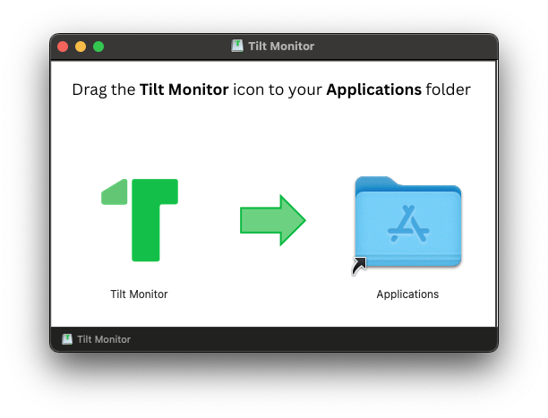

# Changelog

<hr/><h1 tag="1.1.2" date="2025-07-09">v1.1.2</h1>

**Tilt Monitor** is now packaged and released as a Disk Image (`Tilt-Monitor-x.x.x.dmg`), so you can install it natively on macOS (you can still install from sources like before if you prefer though).  

<br/>

**Note:** This app is not signed by Apple, so when installing via Disk Image, macOS GateKeeper might prevent you from launching it.  
If that happens, you'll need to allow it either manually via **System Settings** >> **Privacy & Security**, or, by removing the quarantine attribute via command line:  
```shell
xattr -dr com.apple.quarantine "/Applications/Tilt Monitor.app"
```

<hr/><h1 tag="1.0.5" date="2025-06-30">v1.0.5</h1>

Add support for configuration of custom environment variables, that are required but missing from the vanilla env spun up by the app.

**Example:**  


<hr/><h1 tag="1.0.4" date="2025-06-13">v1.0.4</h1>

# Tilt Monitor


Tilt Monitor is a macOS menu bar application that provides real-time status monitoring for [Tilt](https://tilt.dev/).  

It replicates Tilt's favicon status colors, and allows you basic control over Tilt's status (start/stop), as well as quick access to the Tilt dashboard to view your resources.

## Features

- **Dynamic Menu Bar Icon**: Real-time status monitoring with a dynamically colored icon that reflects the state of your Tilt environment.
- **Graceful Process Management**: Starts and stops the Tilt daemon gracefully using `tilt up` and `tilt down`.
- **Easy Configuration**: Configure the app via a simple JSON file, with a menu option to open it directly.

## Disclaimer

[Tilt](https://tilt.dev/) is a trademark of its respective owner. [Tilt Monitor](https://github.com/tidharm/tilt-monitor) is an independent project and is not affiliated with, endorsed by, or sponsored by [Tilt](https://tilt.dev/) or the [Tilt.dev](https://github.com/tilt-dev) team.
The use of the **Tilt** name and associated branding elements (including iconography) is solely for identification and compatibility purposes, in accordance with nominative fair use principles. I make no claim to any rights in the **Tilt** name or logo.

If you are a rights holder and believe that any usage in this project violates your intellectual property or trademark rights, please contact me. I am committed to acting in good faith and will promptly address any concerns — including providing attribution, modifying the materials, or removing them if necessary.
