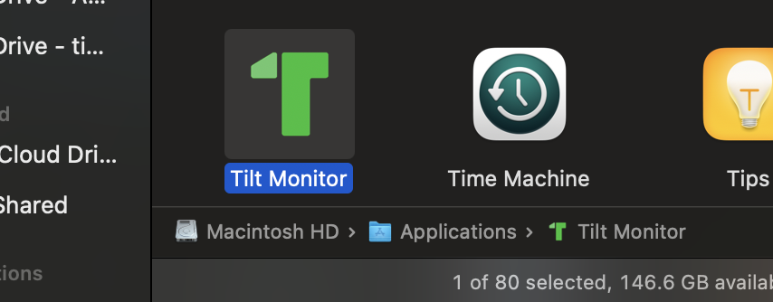
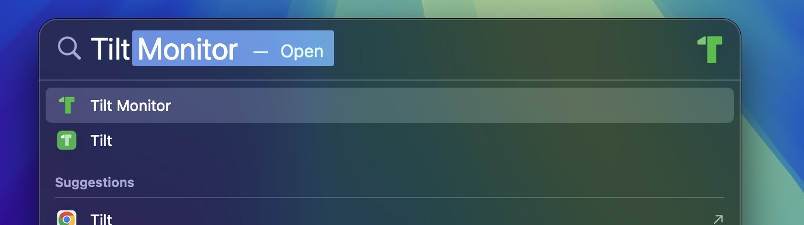
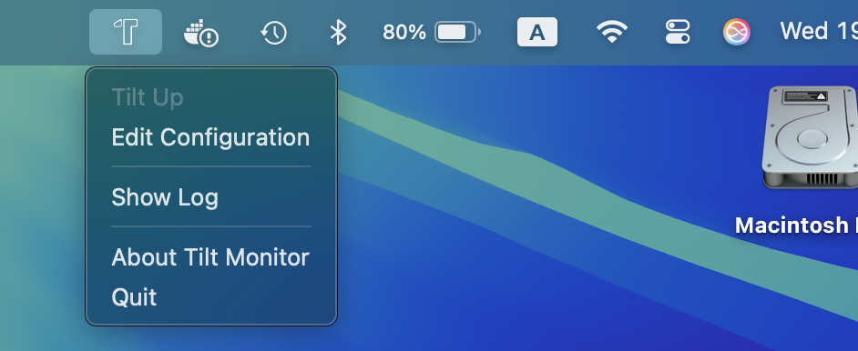
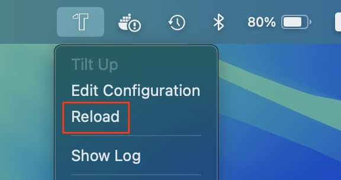

[](https://www.apache.org/licenses/LICENSE-2.0)
[](https://www.python.org/downloads/release/python-390/)

# Tilt Monitor

<br/>

Tilt Monitor is a macOS menu bar application that provides real-time status monitoring for [Tilt](https://tilt.dev/).  

It replicates Tilt's favicon status colors, and allows you basic control over Tilt's status (start/stop), as well as quick access to the Tilt dashboard to view your resources.

## Features

- **Dynamic Menu Bar Icon**: Real-time status monitoring with a dynamically colored icon that reflects the state of your Tilt environment.
- **Graceful Process Management**: Starts and stops the Tilt daemon gracefully using `tilt up` and `tilt down`.
- **Easy Configuration**: Configure the app via a simple JSON file, with a menu option to open it directly.

## Installation

1. Clone the repository:
   ```
   git clone https://github.com/tidharm/tilt-monitor.git
   cd tilt-monitor
   ```

2. Run the build script:
   ```
   python build.py
   ```

   When the build finishes, the packaged application will be available in the `package/Tilt Monitor.app` directory.  
   It is recommended to move it to the `/Applications` directory.

## Usage

1. Start the application by launching it from Finder or Spotlight:  

    
    
    <br/>

    **First time only:**  
    Click on **Edit Configuration** to specify the path to the main Tiltfile ([config](#configuration) param `tilt_base_url`).  
    Make sure to click **Reload** after modifying the configuration file.  

    
    
    <br/>
    
    > If the **Tilt Up** menu option remains grayed out after reload, it means the specified path is incorrect/invalid.  
    

2. Click on **Tilt Up**

    The menu bar icon shows the current status of Tilt:

    |                                                                                                                 |                                        |
    |-----------------------------------------------------------------------------------------------------------------|----------------------------------------|
    |  | Tilt is not running                    |
    |                | Tilt is starting or in a pending state |    
    |                  | One or more resources have errors      |
    |              | All resources are healthy              |
    

### Menu Options:  

|                         |                                                       |
|-------------------------|-------------------------------------------------------|
| **Tilt Up / Tilt Down** | Start or stop the Tilt daemon                         |
| **Open Tilt UI**        | Open the Tilt web interface in your default browser   |
| **Edit Configuration**  | Open the configuration file in your default editor    |
| **Reload**              | Reload the application to apply configuration changes |
| **Show Log** \*         | Open the application's log file                       |
| **About Tilt Monitor**  | Display the application's version and description     |
| **Quit**                | Stop the Tilt daemon and quit the application         |

> \* Log files are located under `~/Library/Logs/TiltMonitor`  

## Configuration

Configuration options:

| Parameter            | Default                  | Description                                                                                                          |
|----------------------|--------------------------|----------------------------------------------------------------------------------------------------------------------|
| `tilt_file_path`*    | `-`                      | Path to your `Tiltfile` or the directory that contains it<br/>**Must be specified before first use**                 |
| `tilt_base_url`      | `http://localhost:10350` | URL for the Tilt API                                                                                                 |
| `tilt_context`       | `docker-desktop`         | Kubernetes context to use with Tilt                                                                                  |
| `keepalive_interval` | 3                        | Time interval in seconds for status checks when Tilt is running                                                      |
| `sleep_interval`     | 30                       | Time interval in seconds for status checks when Tilt is down                                                         |
| `tilt_cmd_args`      | `-`                      | Additional command-line arguments for the `tilt up` command, if needed                                               |
| `env_vars`           | `{}`                     | An object that allows specifying requirement environment variables that are missing in the app's vanilla environment |

> \* The configuration file is located at `~/Library/Application Support/TiltMonitor/tilt_monitor_config.json`.


## License

See the [LICENSE](LICENSE) file for details.


## Disclaimer

[Tilt](https://tilt.dev/) is a trademark of its respective owner. [Tilt Monitor](https://github.com/tidharm/tilt-monitor) is an independent project and is not affiliated with, endorsed by, or sponsored by [Tilt](https://tilt.dev/) or the [Tilt.dev](https://github.com/tilt-dev) team.
The use of the **Tilt** name and associated branding elements (including iconography) is solely for identification and compatibility purposes, in accordance with nominative fair use principles. I make no claim to any rights in the **Tilt** name or logo.

If you are a rights holder and believe that any usage in this project violates your intellectual property or trademark rights, please contact me. I am committed to acting in good faith and will promptly address any concerns — including providing attribution, modifying the materials, or removing them if necessary.

 
